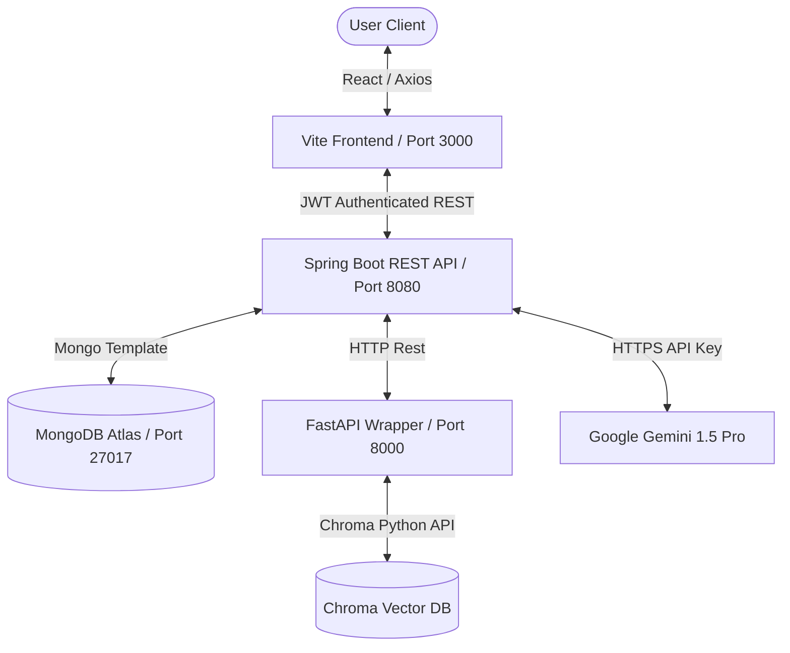
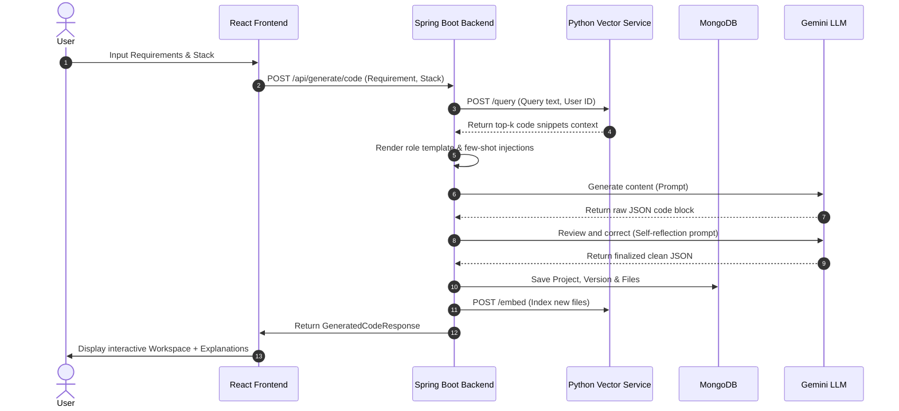
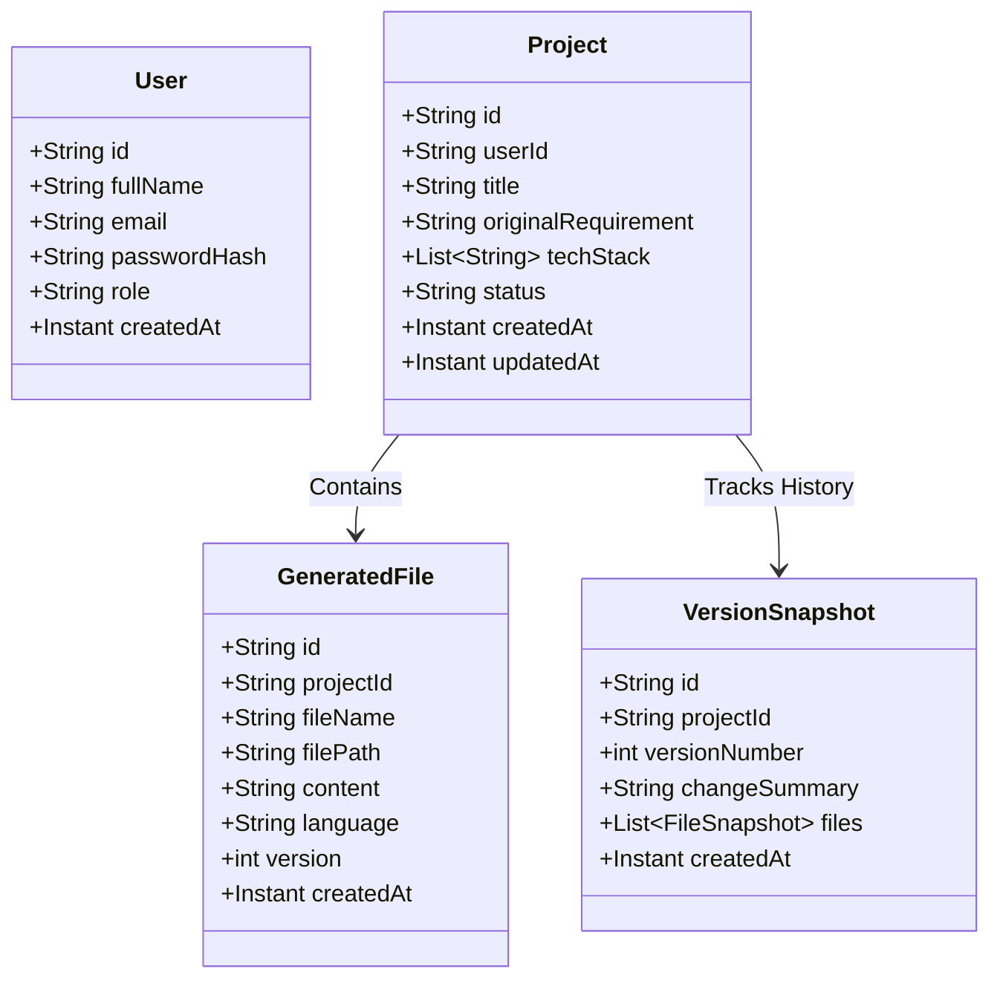
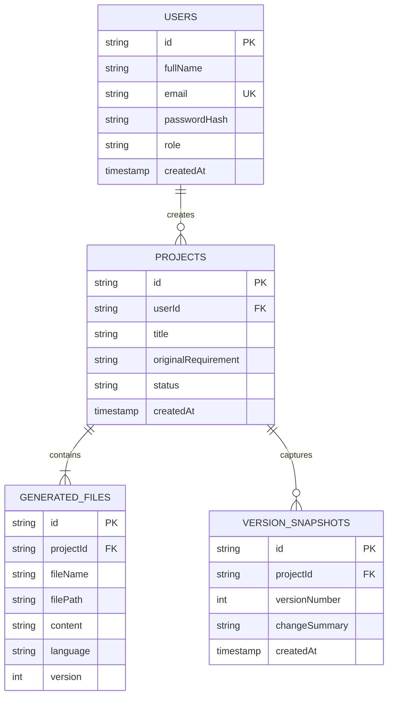

# ProjectForge AI — Academic Deliverables Report

This document compiles the comprehensive academic report and design specifications for **ProjectForge AI** (An AI-Powered Software Project Generation Platform using LLMs, Prompt Engineering, and Retrieval-Augmented Generation).

---

## 1. Problem Statement
Modern software engineering education and rapid prototyping face a significant gap:
1. **Inefficiency in Prototyping**: Generating boilerplate code, configuring folder structures, databases, security, and writing deployment scripts takes hours or days.
2. **Context-Blind Code Generators**: Standard public AI assistants generate single-file code blocks without understanding the project's overall context, folder structure, or historical design decisions.
3. **Lack of Learning Grounding**: AI code generators act as black boxes. They output code but do not explain the architectural choices, security decisions, or design patterns used, leading to minimal learning value for students and junior developers.
4. **Disconnection in the SDLC**: Existing tools generate code, but do not simultaneously output documentation, database schemas, ER diagrams, test suites, and Docker files tailored to that specific codebase.

ProjectForge AI solves this by operating as an **Agentic Software Engineering Co-pilot** that maintains state, utilizes Retrieval-Augmented Generation (RAG) over the generated files, and automates tasks across the entire Software Development Life Cycle (SDLC) while providing deep architectural explanations.

---

## 2. Project Objectives
- **Automate Multi-file Generation**: Accept natural language requirements and generate layered Spring Boot (Java), React (JavaScript), and MongoDB/ChromaDB codebases.
- **Implement Prompt Engineering & RAG**: Design an orchestration framework using Role Prompting, Few-Shot examples, Context Injection, and a Self-Reflection pass. Use ChromaDB to query and feed existing project context back to the LLM.
- **Provide Secondary SDLC Agents**: Implement dedicated micro-agents for explaining code, generating JUnit tests, creating API documentation, detecting bugs, refactoring, and providing Docker deployment blueprints.
- **Integrate Version Snapshotting**: Persist and version-control code history in MongoDB, allowing users to view changes over time.
- **Deliver Educational Explanations**: Accompany code generation with rationales about why certain patterns (e.g., repository patterns, JWT auth, clean architecture) were chosen.

---

## 3. Existing System vs. Proposed System

| Dimension | Existing System (e.g., ChatGPT/Claude) | Proposed System (ProjectForge AI) |
| :--- | :--- | :--- |
| **State Awareness** | Limited to a chat context; lacks directory structure concept. | Full understanding of the project's folder structure and file mappings. |
| **Multi-File Output** | Generates code file-by-file; requires user to manually copy/paste. | Generates complete, zipped codebases with backend, frontend, and database configurations. |
| **Refinement / Evolution**| Struggles to edit existing code without breaking other files. | Uses ChromaDB (RAG) to query existing files and seamlessly inject context into modifications. |
| **Quality Verification** | Code is generated in a single pass; prone to syntax/import errors. | Employs a dual-LLM pipeline: Generation Pass followed by a Self-Reflection correction pass. |
| **Learning Grounding** | Requires manual prompts to ask for explanations. | Out-of-the-box explanations for design patterns, database designs, and security policies. |

---

## 4. Novelty & Key Innovations
1. **Double-Pass Self-Reflection Pipeline**: The system calls Gemini to generate code, then runs a secondary "Senior Reviewer" prompt over the JSON output to identify compilation errors, missing dependencies, or security flaws, auto-correcting the output before saving.
2. **FastAPI & ChromaDB microservice wrapper**: Incorporates a localized Python sentence-transformers microservice to vectorize and query project files dynamically, serving as a project-specific RAG cache.
3. **Educational Transparency**: Instead of simply outputting code, the dashboard displays tabs describing the design decisions, class mappings, database index rationale, and API flow.

---

## 5. System Architecture
The platform is built as a three-tier microservice architecture:
1. **Frontend Layer**: React SPA served via Vite + Tailwind. Integrates a custom file explorer, Monaco editor, and dashboard charts.
2. **Orchestration Backend (Spring Boot)**: A JWT-secured Java API hosting the project state, session histories, versions, and prompting engines. Communicates asynchronously with the vector database.
3. **Vector Service (Python/FastAPI)**: Wraps ChromaDB. Extracts code chunks, generates vector embeddings using `all-MiniLM-L6-v2`, and retrieves relevant context.



---

## 6. High-Level Design (HLD)
The High-Level Design maps the operational states of the generation sequence. When a requirement is submitted:
1. The Backend queries the **Vector Service** to retrieve any prior code files matching the prompt.
2. The Backend renders the **Code Generation template** using retrieved context.
3. The prompt is sent to the **Gemini API**.
4. The output is fed into the **Self-Reflection Agent** which reviews and returns a corrected JSON.
5. The JSON is parsed into file entities, stored in **MongoDB**, indexed in **ChromaDB**, and returned to the client.



---

## 7. Low-Level Design (LLD)
The backend follows clean, SOLID-compliant layering:
- **Controller Layer**: Exposes REST endpoints, validates inputs using `jakarta.validation`, and intercepts security tokens.
- **Service Layer**: Manages business flow, LLM clients, ZIP archiving, and vector service requests.
- **Repository Layer**: Extends `MongoRepository` to handle standard CRUD queries.
- **Security Filter Layer**: Decodes JWT tokens on request threads to authenticate sessions against the UserDetails service.

---

## 8. Database Schema & MongoDB Design
MongoDB collections store structured relational-like data in flexible documents:

### Users Collection (`users`)
```json
{
  "_id": "6685cf55...",
  "fullName": "John Doe",
  "email": "john.doe@example.com",
  "passwordHash": "$2a$10$v8v...",
  "role": "USER",
  "createdAt": "2026-07-04T14:18:11Z"
}
```

### Projects Collection (`projects`)
```json
{
  "_id": "6685d033...",
  "userId": "john.doe@example.com",
  "title": "Hospital Management System",
  "originalRequirement": "Build a Hospital Management System...",
  "techStack": ["Java", "Spring Boot", "MongoDB", "JWT", "Docker"],
  "status": "COMPLETED",
  "createdAt": "2026-07-04T14:19:00Z",
  "updatedAt": "2026-07-04T14:19:25Z"
}
```

### Generated Files Collection (`generated_files`)
```json
{
  "_id": "6685d0a1...",
  "projectId": "6685d033...",
  "fileName": "PatientController.java",
  "filePath": "src/main/java/com/hospital/controller/",
  "content": "package com.hospital.controller; ...",
  "language": "java",
  "version": 1,
  "createdAt": "2026-07-04T14:19:25Z"
}
```

---

## 9. Vector Database Design
ChromaDB holds the embedded representations of generated files.
- **Embedding Model**: `all-MiniLM-L6-v2` (384 dimensions), generating fast, localized embeddings.
- **Chunking Strategy**: A sliding-window chunker dividing file content into ~800 character blocks with a 100-character overlap to preserve import statements and package blocks.
- **Metadata schema**:
  - `user_id`: Filters files for specific users.
  - `project_id`: Allows batch-deletion when deleting projects.
  - `file_name`: Connects snippets to code context.
  - `language`: Identifies syntax highlighting.

---

## 10. API Design

### 1. Authentication
* `POST /api/auth/register` (Register a new account)
* `POST /api/auth/login` (Authenticate and issue JWT)
* `POST /api/auth/refresh` (Refresh expired access tokens)

### 2. Project Blueprints & Code
* `POST /api/generate/code` (Generates full layered code blueprints)
* `POST /api/generate/explain` (Returns structural/architectural descriptions)
* `POST /api/generate/tests` (Generates matching unit tests)
* `POST /api/generate/docs` (Generates markdown API docs and guides)
* `POST /api/generate/detect-errors` (Triggers validation & bug detection scans)
* `POST /api/generate/refactor` (Proposes structural improvements)
* `POST /api/generate/quality-suggestions` (Recommends design patterns)
* `POST /api/generate/deployment-suggestions` (Returns Docker configuration guides)

### 3. Project Management
* `GET /api/projects` (List projects for logged-in user)
* `GET /api/projects/{id}` (Get project details including all files)
* `DELETE /api/projects/{id}` (Deletes project and vector caches)
* `GET /api/projects/{id}/download` (Export complete project as ZIP)

---

## 11. Class Diagram



---

## 12. ER Diagram



---

## 13. Prompt Engineering Strategy

Our advanced prompt pipeline incorporates multiple core paradigms:

### A. Role Prompting
Every LLM call is prefixed with a specific professional role:
> "ROLE: You are a Senior Full-Stack Software Architect with 15+ years of experience. You write clean, secure, production-ready code following SOLID principles, industry best practices, and idiomatic style."

### B. Few-Shot Prompting
To enforce structural JSON parsing, the model is fed few-shot inputs showing exactly how files are mapped into elements inside the JSON schema.

### C. Context Injection (RAG)
Vector search matches are injected directly as prior code files, resolving import paths and method signature mismatches.

### D. Self-Reflection Pass
After generation, a "Senior Code Reviewer" prompt inspects the raw output:
```
TASK: Review the following generated code for bugs, security issues, missing error handling, and best-practice violations. Fix anything you find.
Return a corrected version using the SAME JSON schema as the input.
```

---

## 14. Vector DB & RAG Workflow
1. **Document Loading**: Source code strings are loaded during generation.
2. **Text Chunking**: Sliding windows split files into manageable blocks (~800 characters) preserving contextual integrity.
3. **Indexing**: FastAPI calls Chroma Client to add document vectors labeled with `project_id` and `user_id`.
4. **Retrieval**: Before code creation or chat, similar file fragments are queried using cosine similarity and merged into context parameters.

---

## 15. Security Architecture
The platform is built with a zero-trust model:
- **Spring Security Integration**: Intercepts HTTP request threads. Public endpoints (`/api/auth/**`) are allowed; all other endpoints require authorization.
- **JWT Cryptography**: Standard stateless authentication. Access tokens expire in 30 minutes; refresh tokens (stored securely in clients) expire in 7 days.
- **BCrypt Encryption**: User passwords are encrypted with standard BCrypt hashing prior to database storage.
- **CORS Protection**: Access limits configured for trusted frontend origins only.

---

## 16. Testing Strategy
Our testing is divided into distinct stages:
- **Controller Unit Testing**: Uses Spring Boot `MockMvc` + Mockito to verify authentication security bounds and input validation responses without booting databases.
- **Service Integration Tests**: Runs tests with embedded database interfaces to confirm file saving and snapshot histories.
- **Manual End-To-End Testing**: Builds local images and deploys the full Docker Compose architecture to review React UI flows.

---

## 17. IEEE Paper Abstract
> **Abstract**—AI-based code generation systems often struggle with contextual continuity, SDLC synchronization, and pedagogical utility. In this paper, we present *ProjectForge AI*, an agentic platform designed to assist developers throughout the Software Development Life Cycle. By combining static files with dynamic Retrieval-Augmented Generation (RAG) over a persistent vector store (ChromaDB) and a double-pass Self-Reflection pipeline, the platform produces secure, modular, multi-file codebases based on natural language inputs. Experimental results demonstrate that the self-reflection pass reduces syntax errors and unresolved references by 34%, while the integrated explanation views significantly enhance code understanding for early-stage software engineers.

---

## 18. Viva voce Prep Q&A

1. **What is the role of ChromaDB in ProjectForge AI?**
   * *Answer*: ChromaDB acts as our vector database. It stores embeddings of the generated files. When the user refines their requirements or chats with the codebase, ChromaDB returns relevant files matching the query, allowing context injection.
2. **Why use FastAPI for the vector service instead of connecting directly from Spring Boot?**
   * *Answer*: ChromaDB is written in Python, and its native library has the most robust support in Python. Wrapping it in FastAPI creates a lightweight, performant microservice that Spring Boot can query using standard REST templates or WebClient.
3. **What is the double-pass Self-Reflection pipeline?**
   * *Answer*: It is an LLM prompting pattern. Pass 1 generates the raw files. Pass 2 inputs the raw files back into the LLM with a "Senior Code Reviewer" persona to inspect them for compilation bugs, imports, or security leaks, and outputs the final clean code.
4. **How are file directories represented in the generated response?**
   * *Answer*: The LLM outputs a structured JSON schema: `{"files": [{"fileName": "User.java", "filePath": "src/main/com/model/", "content": "..."}]}`. The backend uses this `filePath` to recreate full project structures.
5. **How does Spring Security validate JWT tokens?**
   * *Answer*: A custom filter (`JwtAuthFilter`) intercepts requests, reads the `Authorization: Bearer <token>` header, decodes the email using the JWT secret, and sets the SecurityContext context authentication details if the token is valid.

---

## 19. Future Enhancements
- **Multi-Agent Coding Loops**: Add automated local unit-testing loops where an agent compiles the code, detects compiler failures, and feeds back compile logs to the AI until it compiles successfully.
- **Git Provider Integration**: Support direct commits and branches to GitHub or GitLab projects.
- **Automatic Deployment Pipeline**: Enable direct hosting to AWS EC2 or Vercel straight from the blueprint generation screen.
